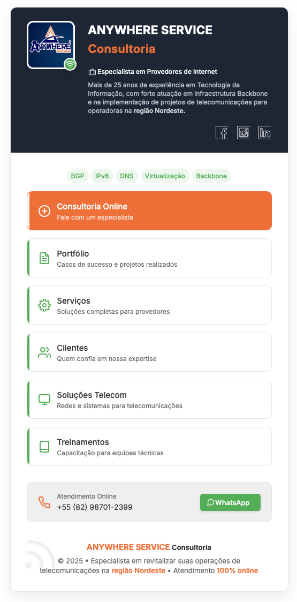

# Anywhere Service Consultoria


<div align="center">
  
</div>

## 📱 Visualização

Este é um cartão digital responsivo para a Anywhere Service Consultoria, uma empresa especializada em consultoria para provedores de internet, com sede em **União dos Palmares - AL** e mais de 25 anos de experiência em Tecnologia da Informação, infraestrutura Backbone e implementação de projetos de telecomunicações para operadoras na **região Nordeste**.

## 📋 Descrição

O projeto consiste em um cartão digital responsivo que serve como ponto de contato para a Anywhere Service Consultoria. O design é limpo, minimalista e totalmente adaptável a diferentes tamanhos de tela, garantindo uma experiência de usuário consistente em dispositivos móveis e desktop. A empresa oferece **atendimento 100% online** para toda a região Nordeste.

## 🗺️ Área de Atendimento

### **Sede da Empresa:**
- **União dos Palmares - AL** (CEP: 57800-000)

### **Estados Atendidos (100% Online):**
- **Alagoas (AL)** - Sede
- **Pernambuco (PE)**
- **Sergipe (SE)**
- **Bahia (BA)**

### **Principais Cidades Atendidas:**
#### Alagoas
- União dos Palmares ⭐ (Sede)
- Maceió
- Arapiraca

#### Pernambuco  
- Recife
- Caruaru
- Vitória de Santo Antão

#### Sergipe
- Aracaju
- Nossa Senhora do Socorro
- Lagarto
- Itabaiana

#### Bahia
- Salvador
- Feira de Santana
- Vitória da Conquista
- Camaçari
- Juazeiro
- Lauro de Freitas

## 🛠️ Tecnologias Utilizadas

- HTML5 com **Schema Markup** completo
- CSS3 (com variáveis CSS e media queries para responsividade)
- Fontes Google (Inter, Montserrat, Ysabeau Infant)
- Animações CSS
- **SEO otimizado** para 4 estados do Nordeste
- **Acessibilidade WCAG** implementada

## ✨ Funcionalidades

- **Design Responsivo**: Adapta-se perfeitamente a diferentes tamanhos de tela, desde smartphones pequenos até desktops.
- **Atendimento 100% Online**: Links diretos para contato remoto via WhatsApp e email.
- **SEO Regional Avançado**: Otimizado para 17 cidades específicas do Nordeste.
- **Schema Markup Completo**: 3 tipos de Schema (ProfessionalService, FAQPage, LocalBusiness).
- **Integração com Redes Sociais**: Links para perfis no Facebook, Instagram e LinkedIn.
- **Acessibilidade Total**: ARIA labels, skip links, navegação por teclado.
- **Animações Suaves**: Efeitos visuais para melhorar a experiência do usuário.

## 📊 Especialidades Destacadas

- BGP (Border Gateway Protocol)
- IPv6
- DNS (Domain Name System)
- Virtualização
- Backbone

## 🚀 Como Usar

1. Clone este repositório:
```bash
git clone https://github.com/seuusuario/anywhereservice-card.git
```

2. Abra o arquivo `index.html` em seu navegador ou hospede em um servidor web.

3. Para modificar o conteúdo, edite o arquivo `index.html`.

4. Para alterar estilos, modifique o arquivo `assets/css/style.css`.

## 📏 Estrutura do Projeto

```
anywhereservice-card/
│
├── assets/
│   ├── css/
│   │   ├── style.css
│   │   └── style.css.backup
│   ├── documents/
│   │   └── portifolio_anywhere.pdf
│   ├── icons/
│   │   ├── book.svg
│   │   ├── file-text.svg
│   │   ├── message-circle-2.svg
│   │   ├── monitor-2.svg
│   │   ├── phone.svg
│   │   ├── plus-circle.svg
│   │   ├── rss-3.svg
│   │   ├── settings.svg
│   │   ├── Social-01-Facebook-Outline_icon-icons.com_66389.svg
│   │   ├── Social-32-Instagram-Outline_icon-icons.com_66387.svg
│   │   ├── Social-35-Linkedin-Outline_icon-icons.com_66384.svg
│   │   ├── summer_travel_holidays_vacation_suitcase_luggage_icon_148873.svg
│   │   ├── users.svg
│   │   └── wifi-3.svg
│   └── img/
│       └── logo.jpeg
├── .gitignore
├── index.html
└── README.md
```

## 🔍 Características CSS

- **Variáveis CSS**: Facilita a manutenção e alteração de cores e valores.
- **Flexbox**: Utilizado para layout responsivo e alinhamento de elementos.
- **Media Queries**: Ajustam o layout para diferentes tamanhos de tela.
- **Animações**: Efeitos suaves para melhorar a experiência do usuário.
- **Mobile-First**: Design otimizado para dispositivos móveis.

## 📱 Breakpoints Responsivos

O design se adapta aos seguintes breakpoints:

- **Até 480px**: Smartphones
- **Até 440px**: Smartphones menores
- **Até 430px**: Ajustes específicos
- **Até 414px**: iPhone 11, XR, 12, 13, 14 padrão
- **Até 400px**: Smartphones muito pequenos
- **Até 375px**: iPhone SE, 8, X, 11 Pro
- **Até 320px**: Smartphones extremamente pequenos

## 🎯 SEO e Performance

### **Schema Markup Implementado:**
- **ProfessionalService**: Dados da empresa e serviços
- **FAQPage**: Perguntas frequentes sobre atendimento online
- **LocalBusiness**: Informações de localização e área de atendimento

### **Otimizações Implementadas:**
- Meta tags completas (Open Graph, Twitter Cards)
- Lazy loading nas imagens
- Preconnect para fontes Google
- Rich snippets configurados
- Sitemap structure ready

### **Palavras-chave Alvo:**
- "consultoria TI união dos palmares"
- "consultoria online nordeste"
- "provedor internet alagoas"
- "BGP nordeste"
- "IPv6 bahia"
- "telecomunicações sergipe"
- "atendimento remoto TI"

## 🔄 Manutenção

Para atualizar o conteúdo do cartão digital:

1. **Conteúdo**: Edite o arquivo `index.html` para modificar textos, links e estrutura.

2. **Cores e Estilos**: Altere as variáveis no arquivo `style.css`:

```css
:root {
  --primary-blue: #1e2635;
  --primary-orange: #f26c29;
  --primary-green: #4caf50;
  --light-bg: #ffffff;
  --dark-text: #333333;
  --mid-text: #666666;
  --light-text: #ffffff;
  --border-color: #e5e5e5;
}
```

3. **Localização**: Para alterar cidade/coordenadas, atualize o Schema markup (linhas 28-45 do HTML).

4. **Área de Atendimento**: Modifique o array `serviceArea` no Schema para adicionar/remover cidades.

## 📞 Contato

- **WhatsApp**: +55 (82) 98701-2399
- **Email**: clodoaldo@anywhereservice.com.br
- **Website**: [anywhereservice.com.br](https://www.anywhereservice.com.br)
- **Sede**: União dos Palmares - AL
- **Atendimento**: 100% Online - Região Nordeste
- **Redes Sociais**:
  - [Facebook](https://facebook.com/anywhereservice)
  - [Instagram](https://instagram.com/anywhereservice)
  - [LinkedIn](https://linkedin.com/in/clodoaldo-silva-79303b26)

## 🏆 Diferenciais Técnicos

- **Acessibilidade WCAG 2.1**: Navegação por teclado, screen readers, ARIA labels
- **Performance Otimizada**: Lazy loading, CSS minificado, fontes otimizadas
- **SEO Avançado**: Schema markup triplo, rich snippets, meta tags completas
- **Mobile-First**: Design responsivo com breakpoints específicos
- **Cross-Browser**: Compatível com todos os navegadores modernos

## 📈 Resultados SEO Esperados

### **Curto Prazo (1-3 meses):**
- Aparição em "consultoria TI União dos Palmares"
- Rich snippets funcionando
- Posicionamento local em Alagoas

### **Médio Prazo (3-6 meses):**
- Top 3 em buscas regionais do Nordeste
- FAQ aparecendo nos resultados
- Autoridade em termos técnicos + localização

### **Longo Prazo (6+ meses):**
- Referência em consultoria TI interior Alagoas
- Dominância regional Nordeste
- Ponte entre interior e capitais nordestinas

## 📄 Licença

Copyright © 2025 Anywhere Service Consultoria. Todos os direitos reservados.

---

**Desenvolvido por FlawinCode** | Otimizado para SEO Regional Nordeste | Atendimento 100% Online